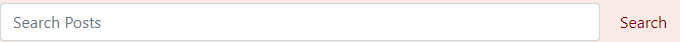
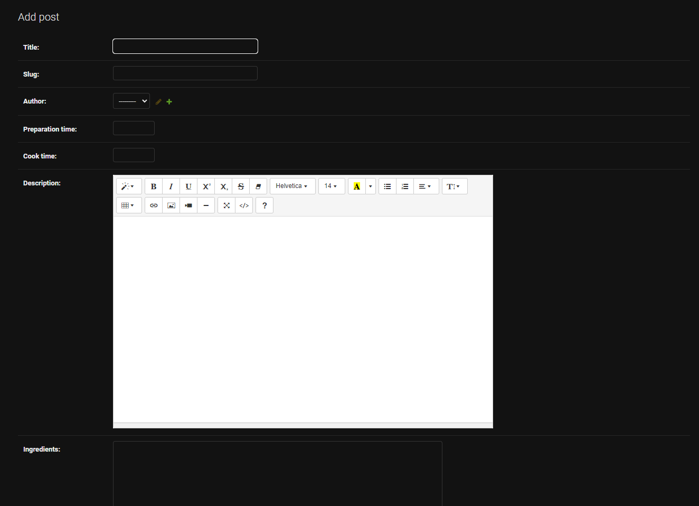

# PORTUGUESE DESSERTS

Portuguese Desserts is a blog for the people who missed the best desserts in the world and missed Portugal. In this blog you can learn how to do your favorite desserts.

<!-- INSERIR IMAGEM "Am I Responsive"-->


The live link can be found here - [Portuguese Desserts](https://portuguese-desserts.herokuapp.com/)

## UX

A visitor to Portuguese Desserts would be someone who is most likely an adult who missed their traditional desserts and trying new recipes but also wants to save time and effort when deciding what to cook for a special occasion.


### Colour Scheme

Explain your colours and the colour scheme.

- `#445261` used as the primary text.
- `#f30c0c` used as the primary highlights.
- `#070707` used as the secondary text.
- `#6c757d` used as the secondary highlights.

I used [coolors.co](https://coolors.co/e84610-009fe3-4a4a4f-445261-d63649-e6ecf0-000000) to generate my colour palette.


### Typography

The Robot Mono font is the main font used for the body of the website with the Playfair Display font used for the main headings on the home page. These fonts were imported via Google Fonts.


## User Stories

In this section, list all of your user stories for the project.

### New Site Users

- As a New Site User I can log into my own account so that I can manage Username and Password information.

### Returning Site Users

- As a Site User I can view a paginated list of posts so that easily select a post to view.
- As a Site User I can edit my comments so that I can change my opinion.
- As a Site User I can delete my comments so that no one can read my comments again.
- As a Site User I can view a paginated list of recipes so that I can select a recipe to view.
- As a Site User I can view comments on an individual post so that I can read the conversation.
- As a site user I can search for a recipe so that I can minimize time searching for what I need.

### Site Admin

- As a Site administrator I can add, filter, change and search for recipes so that I can easily manage my site content.
- As a Site administrator I can view the number of likes on each post so that I can see which is the most popular or viral.
- As a Site administrator I can create, read, update and delete posts so that I can manage my blog content.

## Wireframes

In this section, display your wireframe screenshots using a Markdown `table`.

Instructions on how to do Markdown `tables` start on line #213 on this site: https://pandao.github.io/editor.md/en.html

To follow best practice, wireframes were developed for mobile, tablet, and desktop sizes.
I've used [Balsamiq](https://balsamiq.com/wireframes) to design my site wireframes.

### Mobile Wireframes

| Size | Site Page | Screenshot |
| --- | --- | --- |
| Mobile | Home Page |  |
| Mobile | About Page |  |
| Mobile | Contact Page |  |
| x | x | repeat for all remaining mobile wireframes |

### Tablet Wireframes

| Size | Site Page | Screenshot |
| --- | --- | --- |
| Tablet | Home Page |  |
| Tablet | About Page |  |
| Tablet | Contact Page |  |
| x | x | repeat for all remaining tablet wireframes |

### Desktop Wireframes

| Size | Site Page | Screenshot |
| --- | --- | --- |
| Desktop | Home Page |  |
| Desktop | About Page |  |
| Desktop | Contact Page |  |
| x | x | repeat for all remaining desktop wireframes |

## Features

### Existing Features

### Home Page

Homepage displays the logo name, About Us, Sign Up and Login are the options on the left and search function on the right.
The main body of the homepage contains 6 articles / posts and once more than 6 articles are posted pagination shows links to the next page.
Social media network links are displayed in the footer.

### Logo

- A customised logo was created using freelogodesign which is a free logo generator.
- This logo is positioned in the top left of the navigation bar. The logo is linked to the home page for ease of navigation for the user.


### Navigation Bar

- The navigation bar is present at the top of every page and includes all links to the various other pages.
- The My Account navigation link is a drop down menu which includes the Sign up and Log in links. 
- When the user has logged in, the My Account drop down menu changes to display the user's name and a profile icon.


### Search Bar




### Create an account 


### Login 


### Logout


### Footer


### About Us


### Add Post - Admin Only


### Update/Delete Post - Admin Only


### 500 Page Error
A 500 server error page was created to handle internal server errors.


### Future Features

- Site Users be able to add recipes.
- Allows users to signup to a newsletter / mailing list.
- Contact Form.

## Bugs / Errors encountered during development

* Manage.py was not in the root directory. [Click here](documentation/error3.png)
* App wasn’t deploying to heroku correctly. Updated Procfile from "heard-it" to "heardit"
* Update your requirements.txt - pip3 freeze > requirements.txt and try again. I had a typo in requirements without .txt. [Click here](https://github.com/sherryrich/heard-it/blob/main/docs/error_2.png)
* Template literal typo error "$" instead of "%". [Click here](https://github.com/sherryrich/heard-it/blob/main/docs/error_3.png)
* Error in views.py. '-created' versus '-created_on'. [Click here](https://github.com/sherryrich/heard-it/blob/main/docs/error_4.png)
* Missing comma at the end of this line "STATICFILES_DIRS = [os.path.join(BASE_DIR, 'static'), ]". [Click here](https://github.com/sherryrich/heard-it/blob/main/docs/error_5.png)
* 500 Error because I didn’t have "redirect" imported at top of views.py file. [Click here](https://github.com/sherryrich/heard-it/blob/main/docs/error_6.png)
* Error in the terminal. Heroku updated database so had go to Heroku config vars and copy and paste the new database_url into the env.py to correct. [Click here](https://github.com/sherryrich/heard-it/blob/main/docs/error_7.png)
* Space in the token provided. Caused CSS not to display on the front end as expected. [Click here](https://github.com/sherryrich/heard-it/blob/main/docs/error_8.png)
* Missing closing span. Caused HTML to fail validator rules. [Click here](https://github.com/sherryrich/heard-it/blob/main/docs/error_9.png)
* Search Button was missing on smaller devices so I added a media query and reduced the size of the element on smaller devices. Please see screen shots [Before](https://github.com/sherryrich/heard-it/blob/main/docs/search_box_before.PNG) and [After](https://github.com/sherryrich/heard-it/blob/main/docs/search_box_after.PNG). 
* I was aware of various pylint and flak8 notifications however none of them are having any functionality implications and were as a result of the template followed from the code institute Django blog project Walkthrough.


## Tools & Technologies Used

In this section, you should explain the various tools and technologies used to develop the project.
Make sure to put a link (where applicable) to the source, and explain what each was used for.
Some examples have been provided, but this is just a sample only, your project might've used others.
Feel free to delete any unused items below as necessary.

- [HTML](https://en.wikipedia.org/wiki/HTML) used for the main site content.
- [CSS](https://en.wikipedia.org/wiki/CSS) used for the main site design and layout.
- [CSS :root variables](https://www.w3schools.com/css/css3_variables.asp) used for reusable styles throughout the site.
- [CSS Flexbox](https://www.w3schools.com/css/css3_flexbox.asp) and/or [CSS Grid](https://www.w3schools.com/css/css_grid.asp) used for an enhanced responsive layout.
- [Bootstrap](https://getbootstrap.com) used as the front-end CSS framework for modern responsiveness and pre-built components.
- [JavaScript](https://www.javascript.com) used for user interaction on the site.
- [Python](https://www.python.org) used as the back-end programming language.
- [Git](https://git-scm.com) used for version control. (`git add`, `git commit`, `git push`)
- [GitHub](https://github.com) used for secure online code storage.
- [GitHub Pages](https://pages.github.com) used for hosting the deployed front-end site.
- [Gitpod](https://gitpod.io) used as a cloud-based IDE for development.
- [Tim Nelson](https://traveltimn.github.io/readme-builder) used to help generate the Markdown files.
- [Django](https://www.djangoproject.com) used as the Python framework for the site.
- [PostgreSQL](https://www.postgresql.org) used as the relational database management.
- [ElephantSQL](https://www.elephantsql.com) used as the Postgres database.
- [Heroku](https://www.heroku.com) used for hosting the deployed back-end site.
- [Cloudinary](https://cloudinary.com) used for online static file storage.
- [Summernote](https://summernote.org/) Used to add a text area field to the admin setup to enable a list of ingredients and method steps.
- [Grammarly](https://app.grammarly.com/) - used to proof read the README.md

## Database Design

**Django** Projects:

Entity Relationship Diagrams (ERD) help to visualize database architecture before creating models.
Understanding the relationships between different tables can save time later in the project.

Using your defined models (one example below), create an ERD with the relationships identified.

```python
class Product(models.Model):
    category = models.ForeignKey(
        "Category", null=True, blank=True, on_delete=models.SET_NULL)
    sku = models.CharField(max_length=254, null=True, blank=True)
    name = models.CharField(max_length=254)
    description = models.TextField()
    has_sizes = models.BooleanField(default=False, null=True, blank=True)
    price = models.DecimalField(max_digits=6, decimal_places=2)
    rating = models.DecimalField(
        max_digits=6, decimal_places=2, null=True, blank=True)
    image_url = models.URLField(max_length=1024, null=True, blank=True)
    image = models.ImageField(null=True, blank=True)

    def __str__(self):
        return self.name
```


Using Markdown formatting to represent an example ERD table using the Product model above:

- Table: **Product**

    | **PK** | **id** (unique) | Type | Notes |
    | --- | --- | --- | --- |
    | **FK** | category | ForeignKey | FK to **Category** model |
    | | sku | CharField | |
    | | name | CharField | |
    | | description | TextField | |
    | | has_sizes | BooleanField | |
    | | price | DecimalField | |
    | | rating | DecimalField | |
    | | image_url | URLField | |
    | | image | ImageField | |

## Agile Development Process

Github projects was used to manage the development process using an agile approach. Please see link to project board [here](https://github.com/users/JoaoHigino/projects/7)

The INSERIR Epics listed above were documented within the Github project as Milestones. A Github Issue was created for each User Story which was then allocated to a milestone(Epic). Each User Story has defined acceptance criteria to make it clear when the User Story has been completed. The acceptance criteria are further broken down into tasks to facilitate the User Story's execution.

### GitHub Projects

[GitHub Projects](https://github.com/JoaoHigino/Portuguese_Desserts/projects) served as an Agile tool for this project.
It isn't a specialized tool, but with the right tags and project creation/issue assignments, it can be made to work.

Through it, user stories, issues, and milestone tasks were planned, then tracked on a weekly basis using the basic Kanban board.

Consider adding a basic screenshot of your Projects Board.


### GitHub Issues

[GitHub Issues](https://github.com/JoaoHigino/Portuguese_Desserts/issues) served as an another Agile tool.
There, I used my own **User Story Template** to manage user stories.

It also helped with milestone iterations on a weekly basis.

Consider adding a screenshot of your Open and Closed Issues.

- [Open Issues](https://github.com/JoaoHigino/Portuguese_Desserts/issues)

    

- [Closed Issues](https://github.com/JoaoHigino/Portuguese_Desserts/issues?q=is%3Aissue+is%3Aclosed)

    

### MoSCoW Prioritization

I've decomposed my Epics into stories prior to prioritizing and implementing them.
Using this approach, I was able to apply the MoSCow prioritization and labels to my user stories within the Issues tab.

- **Must Have**: guaranteed to be delivered (*max 60% of stories*)
- **Should Have**: adds significant value, but not vital (*the rest ~20% of stories*)
- **Could Have**: has small impact if left out (*20% of stories*)
- **Won't Have**: not a priority for this iteration

## Testing

For all testing, please refer to the [TESTING.md](TESTING.md) file.

## Deployment

The live deployed application can be found deployed on [Heroku](https://portuguese-desserts.herokuapp.com).

### ElephantSQL Database

This project uses [ElephantSQL](https://www.elephantsql.com) for the PostgreSQL Database.

To obtain your own Postgres Database, sign-up with your GitHub account, then follow these steps:
- Click **Create New Instance** to start a new database.
- Provide a name (this is commonly the name of the project: portuguese_desserts).
- Select the **Tiny Turtle (Free)** plan.
- You can leave the **Tags** blank.
- Select the **Region** and **Data Center** closest to you.
- Once created, click on the new database name, where you can view the database URL and Password.

### Cloudinary API

This project uses the [Cloudinary API](https://cloudinary.com) to store media assets online, due to the fact that Heroku doesn't persist this type of data.

To obtain your own Cloudinary API key, create an account and log in.
- For *Primary interest*, you can choose *Programmable Media for image and video API*.
- Optional: *edit your assigned cloud name to something more memorable*.
- On your Cloudinary Dashboard, you can copy your **API Environment Variable**.
- Be sure to remove the `CLOUDINARY_URL=` as part of the API **value**; this is the **key**.

### Heroku Deployment

This project uses [Heroku](https://www.heroku.com), a platform as a service (PaaS) that enables developers to build, run, and operate applications entirely in the cloud.

Deployment steps are as follows, after account setup:

- Select **New** in the top-right corner of your Heroku Dashboard, and select **Create new app** from the dropdown menu.
- Your app name must be unique, and then choose a region closest to you (EU or USA), and finally, select **Create App**.
- From the new app **Settings**, click **Reveal Config Vars**, and set your environment variables.

| Key | Value |
| --- | --- |
| `CLOUDINARY_URL` | insert your own Cloudinary API key here |
| `DATABASE_URL` | insert your own ElephantSQL database URL here |
| `DISABLE_COLLECTSTATIC` | 1 (*this is temporary, and can be removed for the final deployment*) |
| `SECRET_KEY` | this can be any random secret key |

Heroku needs two additional files in order to deploy properly.
- requirements.txt
- Procfile

You can install this project's **requirements** (where applicable) using:
- `pip3 install -r requirements.txt`

If you have your own packages that have been installed, then the requirements file needs updated using:
- `pip3 freeze --local > requirements.txt`

The **Procfile** can be created with the following command:
- `echo web: gunicorn app_name.wsgi > Procfile`
- *replace **app_name** with the name of your primary Django app name; the folder where settings.py is located*

For Heroku deployment, follow these steps to connect your own GitHub repository to the newly created app:

Either:
- Select **Automatic Deployment** from the Heroku app.

Or:
- In the Terminal/CLI, connect to Heroku using this command: `heroku login -i`
- Set the remote for Heroku: `heroku git:remote -a app_name` (replace *app_name* with your app name)
- After performing the standard Git `add`, `commit`, and `push` to GitHub, you can now type:
	- `git push heroku main`

The project should now be connected and deployed to Heroku!

### Local Deployment

This project can be cloned or forked in order to make a local copy on your own system.

For either method, you will need to install any applicable packages found within the *requirements.txt* file.
- `pip3 install -r requirements.txt`.

You will need to create a new file called `env.py` at the root-level,
and include the same environment variables listed above from the Heroku deployment steps.

Sample `env.py` file:

```python
import os

os.environ.setdefault("CLOUDINARY_URL", "insert your own Cloudinary API key here")
os.environ.setdefault("DATABASE_URL", "insert your own ElephantSQL database URL here")
os.environ.setdefault("SECRET_KEY", "this can be any random secret key")

# local environment only (do not include these in production/deployment!)
os.environ.setdefault("DEBUG", "True")
```

Once the project is cloned or forked, in order to run it locally, you'll need to follow these steps:
- Start the Django app: `python3 manage.py runserver`
- Stop the app once it's loaded: `CTRL+C` or `⌘+C` (Mac)
- Make any necessary migrations: `python3 manage.py makemigrations`
- Migrate the data to the database: `python3 manage.py migrate`
- Create a superuser: `python3 manage.py createsuperuser`
- Load fixtures (if applicable): `python3 manage.py loaddata file-name.json` (repeat for each file)
- Everything should be ready now, so run the Django app again: `python3 manage.py runserver`

#### Cloning

You can clone the repository by following these steps:

1. Go to the [GitHub repository](https://github.com/JoaoHigino/Portuguese_Desserts) 
2. Locate the Code button above the list of files and click it 
3. Select if you prefer to clone using HTTPS, SSH, or GitHub CLI and click the copy button to copy the URL to your clipboard
4. Open Git Bash or Terminal
5. Change the current working directory to the one where you want the cloned directory
6. In your IDE Terminal, type the following command to clone my repository:
	- `git clone https://github.com/JoaoHigino/Portuguese_Desserts.git`
7. Press Enter to create your local clone.

Alternatively, if using Gitpod, you can click below to create your own workspace using this repository.

[](https://gitpod.io/#https://github.com/JoaoHigino/Portuguese_Desserts)

Please note that in order to directly open the project in Gitpod, you need to have the browser extension installed.
A tutorial on how to do that can be found [here](https://www.gitpod.io/docs/configure/user-settings/browser-extension).

#### Forking

By forking the GitHub Repository, we make a copy of the original repository on our GitHub account to view and/or make changes without affecting the original owner's repository.
You can fork this repository by using the following steps:

1. Log in to GitHub and locate the [GitHub Repository](https://github.com/JoaoHigino/Portuguese_Desserts)
2. At the top of the Repository (not top of page) just above the "Settings" Button on the menu, locate the "Fork" Button.
3. Once clicked, you should now have a copy of the original repository in your own GitHub account!

### Local VS Deployment

Use this space to discuss any differences between the local version you've developed, and the live deployment site on Heroku.

## Credits

In this section you need to reference where you got your content, media, and extra help from.
It is common practice to use code from other repositories and tutorials,
however, it is important to be very specific about these sources to avoid plagiarism.

### Content

Use this space to provide attribution links to any borrowed code snippets, elements, or resources.
A few examples have been provided below to give you some ideas.

Ideally, you should provide an actual link to every resource used, not just a generic link to the main site!

| Source | Location | Notes |
| --- | --- | --- |
| [Tim Nelson](https://traveltimn.github.io/readme-builder) | README and TESTING | tool to help generate the Markdown files |
| [Chris Beams](https://chris.beams.io/posts/git-commit) | version control | "How to Write a Git Commit Message" |
| [W3Schools](https://www.w3schools.com/howto/howto_js_topnav_responsive.asp) | entire site | responsive HTML/CSS/JS navbar |
| [W3Schools](https://www.w3schools.com/howto/howto_css_modals.asp) | contact page | interactive pop-up (modal) |
| [W3Schools](https://www.w3schools.com/css/css3_variables.asp) | entire site | how to use CSS :root variables |
| [Flexbox Froggy](https://flexboxfroggy.com/) | entire site | modern responsive layouts |
| [Grid Garden](https://cssgridgarden.com) | entire site | modern responsive layouts |
| [StackOverflow](https://stackoverflow.com/a/2450976) | quiz page | Fisher-Yates/Knuth shuffle in JS |
| [YouTube](https://www.youtube.com/watch?v=YL1F4dCUlLc) | leaderboard | using `localStorage()` in JS for high scores |
| [YouTube](https://www.youtube.com/watch?v=u51Zjlnui4Y) | PP3 terminal | tutorial for adding color to the Python terminal |
| [strftime](https://strftime.org) | CRUD functionality | helpful tool to format date/time from string |
| [WhiteNoise](http://whitenoise.evans.io) | entire site | hosting static files on Heroku temporarily |

### Media

Use this space to provide attribution links to any images, videos, or audio files borrowed from online.
A few examples have been provided below to give you some ideas.

If you're the owner (or a close acquaintance) of all media files, then make sure to specify this.
Let the assessors know that you have explicit rights to use the media files within your project.

Ideally, you should provide an actual link to every media file used, not just a generic link to the main site!
The list below is by no means exhaustive. Within the Code Institute Slack community, you can find more "free media" links
by sending yourself the following command: `!freemedia`.

| Source | Location | Type | Notes |
| --- | --- | --- | --- |
| [Pexels](https://www.pexels.com) | entire site | image | favicon on all pages |
| [Lorem Picsum](https://picsum.photos) | home page | image | hero image background |
| [Unsplash](https://unsplash.com) | product page | image | sample of fake products |
| [Pixabay](https://pixabay.com) | gallery page | image | group of photos for gallery |
| [Wallhere](https://wallhere.com) | footer | image | background wallpaper image in the footer |
| [This Person Does Not Exist](https://thispersondoesnotexist.com) | testimonials | image | headshots of fake testimonial images |
| [Audio Micro](https://www.audiomicro.com/free-sound-effects) | game page | audio | free audio files to generate the game sounds |
| [Videvo](https://www.videvo.net/) | home page | video | background video on the hero section |
| [TinyPNG](https://tinypng.com) | entire site | image | tool for image compression |

### Acknowledgements

Use this space to provide attribution to any supports that helped, encouraged, or supported you throughout the development stages of this project.
A few examples have been provided below to give you some ideas.

- I would like to thank my Code Institute mentor, [John/Jane Doe](https://github.com/username) for their support throughout the development of this project.
- I would like to thank the [Code Institute](https://codeinstitute.net) tutor team for their assistance with troubleshooting and debugging some project issues.
- I would like to thank the [Code Institute Slack community](https://code-institute-room.slack.com) for the moral support; it kept me going during periods of self doubt and imposter syndrome.
- I would like to thank my spouse/partner (John/Jane), for believing in me, and allowing me to make this transition into software development.
- I would like to thank my employer, for supporting me in my career development change towards becoming a software developer.